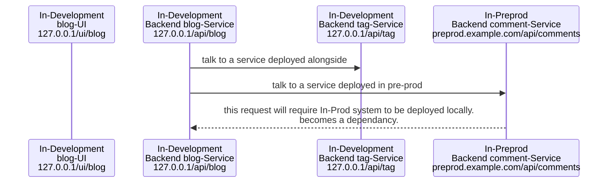
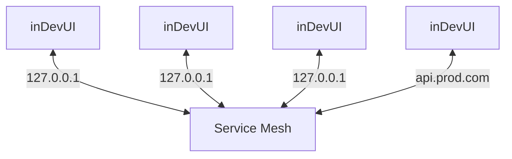

# Pre-Production deployment strategies

1. Product finalises a release; tags tickets with the release number in Jira; plans Sprint, and development starts for that specific release version.
2. Freezing of Release Candidate for QA to test and Sign-off for production release

Once deployed to Pre-Prod, and QA starts testing, we cannot push any new changes to any services; except the bug fixes that have to go in this release.

3. Developers should get an environment to test their development independently. It should be possible if a front-end engineer wants to try their feature integration with a back-end service while it is live or in development.
   1. Developers can use live (pre-prod) services via the link for almost all applications and point to in-development services from test deployments ensuring non-redundant deployments. Developers will have to deploy the changed services for testing manually. Manual configuration of changes is a fair practice as developers are clear about what all services needs modifications compared to the current production setup.

- The configurations can be done at the service mesh level. Engineers will only have to configure the appropriate services mesh config to bring a working system up in local / deployed Kubernetes cluster; with relevant services only enabled.

In a microservice architecture, you typically find:

- Teams are organized around business capabilities such as cross-functional teams of several UI, middleware, and back-end developers, a database administrator, and a DevOps specialist.
- Decentralized governance that allows every team to choose the right tool for their job.
- Decentralized data management that allows each microservice or group of related microservices to manage its own data.
- Testing, deployment, and infrastructure typically are automated with little or no manual intervention.

Ref:

- [Testing Microservices: an Overview of 12 Useful Techniques - Part 1](https://www.infoq.com/articles/twelve-testing-techniques-microservices-intro/)