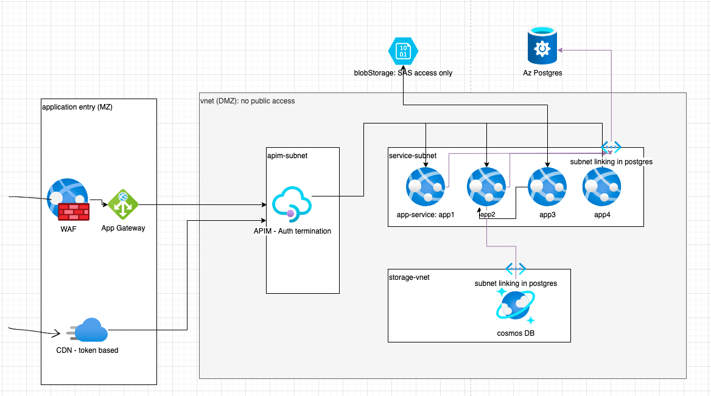

# High Level microservices Web Architecture using Azure PaaS solutions only.

For those who want to quickly get started on developing their microservices without having to worry about the infrastructure provisioning over head, below is the easy and secure architecture.

## Application Gateway (WAF)
- Host
- Backend
- Listener
- Rule

(Insert diagram here)

## Auth termination at APIM

How to authenticate using Auth0 on APIM.

## App Services

How to connect DevOps for CI/CD.

## Storage

### Postgres

Always use hosted postgres by Azure for reduced maintenance.

### BlobStorage