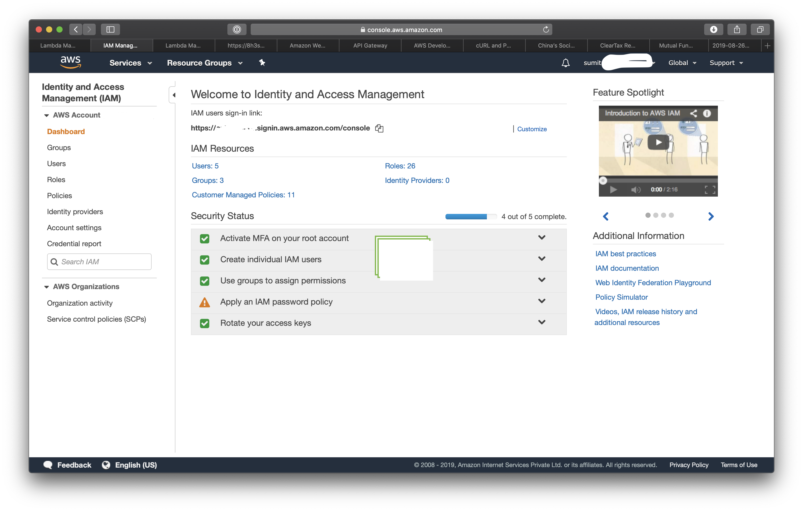
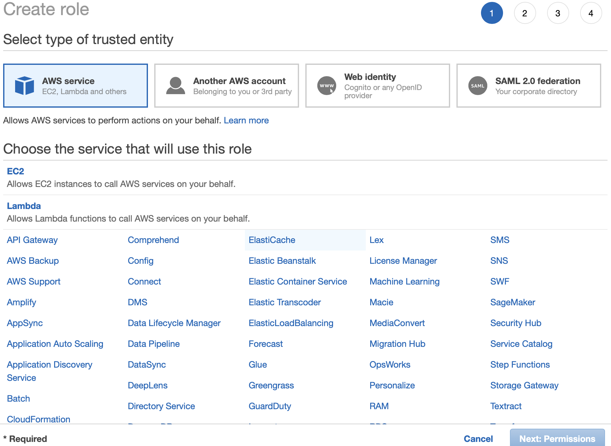

# Starting and Stoping AWS RDS instance using CloudWatch, APIgateway and Lambda

Many times when we start a project, setting up the infra and a pre-production is the first step. My curent project uses AWS RDS to host the Postgres instance that serves our production. And we set up a docker based postgres instance for the pre-prod.

Very soon we ran into issues due to verions differences. Which drove us to _set up the pre-prod Postgres instance in AWS RDS(or wherever your prod db instance is) for parity_. Only difference was the compute configurations.

Of course creating a database in production instance was not an option due to security concerns. _Never share the same instance for your production and anything else_.

The solution was to stop the staging RDS instance every night at 7:30pm. And give developers an API to start the server when they require.

The easiest way to do that in this age of Infrastructure as a Service (IaaS) is to use Lambda to start and stop the RDS instance. And doing this is very simple as well. We just need to give Lambda access to Log to CLoudWatch the logs and rights to start and stop RDS instances.

How we trigger will be handled to the later part. We set the db instance identifier in environment to allow changing it without editing code. While not allowing the same to be passed as a variable via API.

Boto3 a library now maintained by AWS allows us to use python programming language to interact with AWS services.

```
import boto3

rds = boto3.client('rds')

DBinstance = 'db_instance_identifier'

response = rds.stop_db_instance(
            DBInstanceIdentifier=DBinstance
)

```

This is all it takes to stop a running RDS instance. I am assuming that reader has fair bit of knowledge of lambda here. If not, I will explain a bit of how to start a Lambda function.

1. Go to Lambda console after logging into AWS console.
2. Choose your region from top right menu in console.
3. On side panel choose `Functions`.
4. Hit `Create Function`.
5. Choose `Author from Scratch`.
6. Give your function a Name of your choice
7. Choose runtime `Python 3.7 `
8. Under `Permissions` you will see 3 options.
    - Create New role
    - Use an existing
    - Create new role from AWS Policy templates.

## Create IAM role for Lambda

What we need to is to cretae a new Role. So will will have to keep the page idle there an move on to another browser tab. Again Load AWS Console here.

This time Choose `IAM - Identity and Access Management`

Identify and Access Management - takes care of restricting people and processes to services there are authorised to access and execute. As the name pretty much summerises.



1. On the left panel choose `Roles`
2. Hit `Create role`
3. Select "Type of trusted entity" as `Aws services` (this will be auto selected anyways)
4. Under "Choose the service that will use this role" choose `Lambda`

Here we are creating an IAM role for Lambda function.



5. Hit `Next: Permissions`

Next step is to choose the policies for this Role. A Policy is definition of access to each service. In our case, we need to give our Lambda access to RDS, but at the same time we want to restrict the access to only Start and Stop RDS. No other access is allowed in RDS to this Lambda.
There is a way to choose the Policies
