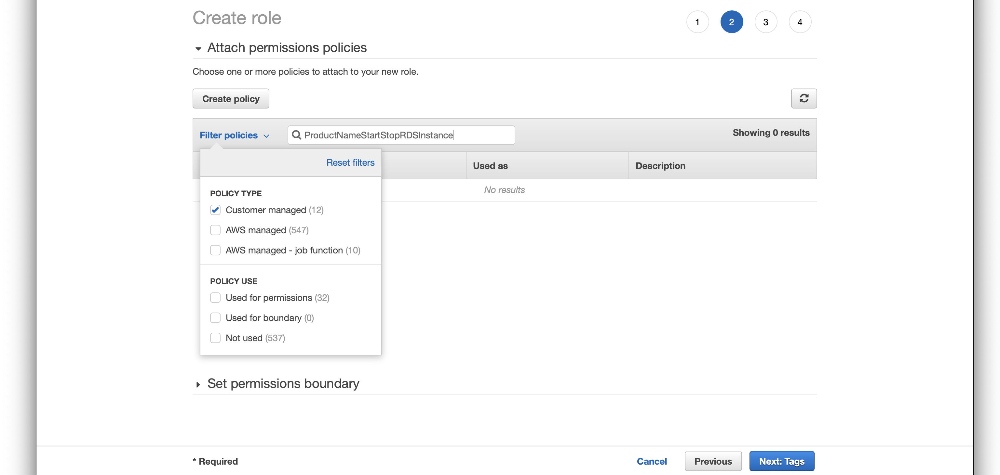
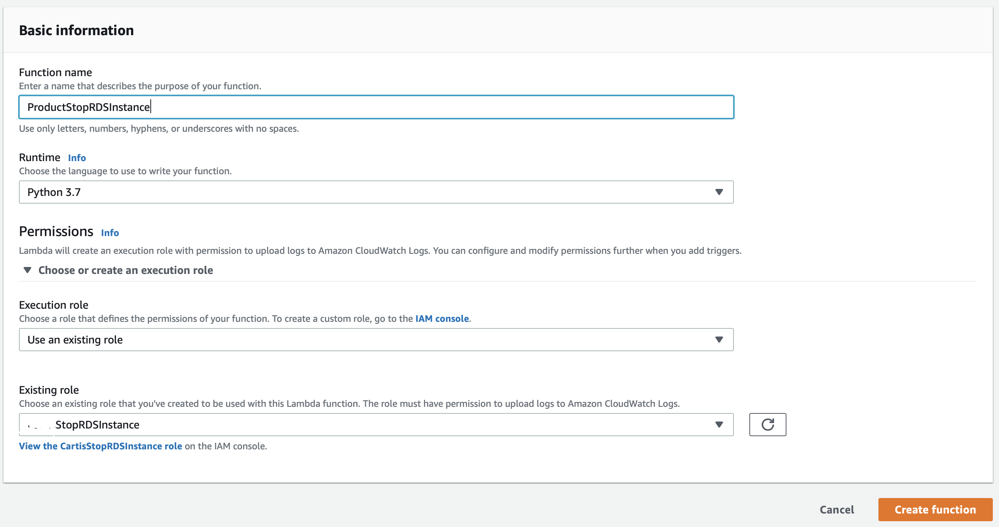

# Starting and Stoping AWS RDS instance using CloudWatch, APIgateway and Lambda

Many times when we start a project, setting up the infra and a pre-production is the first step. My curent project uses AWS RDS to host the Postgres instance that serves our production. And we set up a docker based postgres instance for the pre-prod.

Very soon we ran into issues due to verions differences. Which drove us to _set up the pre-prod Postgres instance in AWS RDS(or wherever your prod db instance is) for parity_. Only difference was the compute configurations.

Of course creating a database in production instance was not an option due to security concerns. _Never share the same instance for your production and anything else_.

The solution was to stop the staging RDS instance every night at 7:30pm. And give developers an API to start the server when they require.

The easiest way to do that in this age of Infrastructure as a Service (IaaS) is to use Lambda to start and stop the RDS instance. And doing this is very simple as well. We just need to give Lambda access to Log to CLoudWatch the logs and rights to start and stop RDS instances.

How we trigger will be handled to the later part. We set the db instance identifier in environment to allow changing it without editing code. While not allowing the same to be passed as a variable via API.

Boto3 a library now maintained by AWS allows us to use python programming language to interact with AWS services.

```
import boto3

rds = boto3.client('rds')

DBinstance = 'db_instance_identifier'

response = rds.stop_db_instance(
            DBInstanceIdentifier=DBinstance
)

```

This is all it takes to stop a running RDS instance. I am assuming that reader has fair bit of knowledge of lambda here. If not, I will explain a bit of how to start a Lambda function.

1. Go to Lambda console after logging into AWS console.
2. Choose your region from top right menu in console.
3. On side panel choose `Functions`.
4. Hit `Create Function`.
5. Choose `Author from Scratch`.
6. Give your function a Name of your choice (eg: ProductStopRDSInstance where Product is replaced with your Product Name)
7. Choose runtime `Python 3.7 `
8. Under `Permissions` you will see 3 options.
    - Create New role
    - Use an existing
    - Create new role from AWS Policy templates.

## Create IAM role for Lambda

What we need to is to cretae a new Role. So will will have to keep the page idle there an move on to another browser tab. Again Load AWS Console here.

This time Choose `IAM - Identity and Access Management`
You dont have to choose a region as IAM is Globally available service.

Identify and Access Management - takes care of restricting people and processes to services there are authorised to access and execute. As the name pretty much summerises.


1. On the left panel choose `Roles`
2. Hit `Create role`
3. Select "Type of trusted entity" as `Aws services` (this will be auto selected anyways)
4. Under "Choose the service that will use this role" choose `Lambda`

Here we are creating an IAM role for Lambda function.


5. Hit `Next: Permissions`

Next step is to choose the policies for this Role. A Policy is definition of access to each service. In our case, we need to give our Lambda access to RDS, but at the same time we want to restrict the access only to Start and Stop RDS. No other access is allowed in RDS to this Lambda.
There is an option to choose the Policies from a search menu. But for ease I would like to add it as a json.

6. On the screen after hitting `Next: Permissions` press the button `Create Policy` which will open a new browser tab.
7. Here, you will find a tab called `JSON`. CHoose that.

You should see a text boz with this text in there

```
{
    "Version": "2012-10-17",
    "Statement": []
}
```

8. We need to replace it with

```
{
    "Version": "2012-10-17",
    "Statement": [
        {
            "Sid": "VisualEditor0",
            "Effect": "Allow",
            "Action": [
                "logs:CreateLogStream",
                "logs:CreateLogGroup",
                "logs:PutLogEvents",
                "rds:DescribeDBInstances",
                "rds:StopDBInstance",
                "rds:StartDBInstance",
                "lambda:GetFunction",
                "lambda:GetFunctionConfiguration"
            ],
            "Resource": "*"
        }
    ]
}
```

This JSON defines that All resources `"Resource": "*"` can do actions `"logs:CreateLogStream",                 "logs:CreateLogGroup", "logs:PutLogEvents",` like creation log stream and group and writing logs into it, `"rds:DescribeDBInstances", "rds:StopDBInstance", "rds:StartDBInstance",` Access information about RDS instances; Start and Stop RDS instances `"lambda:GetFunction", "lambda:GetFunctionConfiguration"` And access the configurations in the Lambda Function so that we can read the environment variables assigned in the function.

In order to enhance security, we can also restrict this rule to apply onlt to our specific service by assigning `"Resource": "arn:aws:rds:ap-south-1:XXXXXXXXXXXX:db:dbinstancename"`

Here,
- "XXXXXXXXXXXX" - is your 12 digit account number in AWS
- dbinstancename is the name of your RDS instance

But in that case, we need to create separate policies by breaking down the {} into multiple hashes under the same `[]` in the JSON, so that each resource can be identified separately. Eg: Logs, RDS and Lambda. Give separate SID values, preferably a better understandable id.

This is recommended to ensure other resources are untouched, for example, no lambda should be stopping our Production RDS instance. Doing this ensures the access is only granted to Staging RDS Instance.

While doing this to restrict access to specific Lambda we have a Catch-22 situations. For this ARN of our Lambda resource to be present, we need to have created the Lambda, which we will be doing once your Rule is ready.

However, if you are very confident that you wouldnt make a spelling mistake, feel free to add the ARN by using the preposed name for your lambda function.

9. `Review Policy` and save the Policy witha name preferebly Prepended with product name. `ProductStartStopRDSInstance`

It is always recommended to create policies for specific jobs, instead of creating a massive Policy of all sactioned actions and giving it every where.
- This ensures fine grain security
- at the cost of management and maintainance which is a given when it comes to security, so no excuses here.

Now that our Policy is mane, go to our Role creation screen
10. Choose `Filter Policies` and select `Customer Managed` you should see your policy there.



11. After chooing your policy, select `Next: Tags`. Give your tags for identifying the services with you r product.

12. Move onto `Review Role`. Give it a Name and saven by clicking on `Create Role`

Now, we have created the Role which is going to be used with the lambda.

## Attaching the IAM role with Lambda

Now, the numbering is going to start from where I left it initially while creating a lambda.

Go back to the browser tab where we have left the lambda creation half way before creating IAM Roles.

We left it to `Use existing Roles` in `Permissions` Section.

9. Choose `Use existing Roles` and attach the role we just created in `Existing Roles` drop down.



10. Click `Create Function`.


You should see your Lambda fuction now with sections,
- The `Designer` section shows you the Access right on various services. This is the section where we are going to add the trigger by clicking `+ Add Trigger` button.
- The `Function code` section, where you are going to edit the function to stop the RDS instance.
    - You will see that the function invoked is specified to be `lambda_function.lambda_handler`
- `Environments Variable` section where we will be setting the DBInstance variable.
    - Go ahead and = do that right away. set the Key to be `DBInstance` and value as your RDS instance name, which you can get from your RDS console instance listing.
- `Tags` section allows you to idnetify this with your product, define the environment name and similar labels.
- `Execution role` shows the role you have assigned jsut now.
- `Basic settings` for defining the memory and timeout. Defaults works in our case.

Lets go to `Function code` section and replace the code inside with this

```
import sys
import botocore
import boto3
from botocore.exceptions import ClientError

def lambda_handler(event, context):
    rds = boto3.client('rds')
    lambdaFunc = boto3.client('lambda')
    try:
        # read the environment variables
        funcResponse = lambdaFunc.get_function_configuration(
            FunctionName='CartisStopRDSInstance'
        )

        # Assign it to variable
        DBinstance = funcResponse['Environment']['Variables']['DBInstanceName']
        
        # stop the RDS instance
        response = rds.stop_db_instance(
            DBInstanceIdentifier=DBinstance
        )
        
        result = {
            'message': 'CartisStopRDSInstance ran successfully.',
        }
        print(response)
        
        # return the result.
        return result
    except ClientError as e:
        print(e)

    return {
        'message': 'CartisStopRDSInstance ran successfully.'
    }

```

The code is commented for your understanding.
After adding this code to editor, `Save` by hitting the top right button in the portal.

Now we need to test the whole setup before we set our trigger, which is CloudWatch (like cron).

Click `Test` button near save button and create a dummy data (dont worry about it as we dont expect any inputs from our trigger)


I belive now your RDS instance must have gone into a `Stopping` state.

Now it is time to create a CloudWatch trigger to run it at every day 7:30pm.

## CloudWatch trigger to execute Lambda at intervals